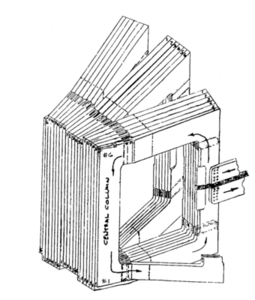

# Scientific Software Coding Problem

## Introduction

Tokamaks confine plasma using powerful electromagnets. These electromagnets can be made with normal conductors, i.e. copper, or with superconductors. Some research tokamaks use copper magnets, but these are power-hungry and thermally limited to short pulses. It is generally accepted that a fusion powerplant will need superconducting magnets. Your task is to explore why this is, by writing software to assess the thermal limitations of copper magnets.

## Copper Toroidal Field Coils for a Tokamak

The toroidal field (TF) coils of a tokamak get their name from the fact that they generate a toroidal magnetic field. This magnetic field is key to confining the hot plasma and ensuring that it does not get into contact with the walls of the vacuum vessel.

As an example, we will discuss the toroidal field coils of Alcator C-Mod, a tokamak that was operated by MIT between 1991-2016.
The illustration below shows a sketch of 3 out of its 20 toroidal field coils.
As you can see, one TF coil is constructed from 6 copper plates, thus the total toroidal field is generated by a total of 120 copper plates, also called turns.

Before the start of operation, these coils would be cooled down to a temperature of 80 Kelvin. During the operation the cooling would be turned off, leading the magnet to heat up.

## Question to Address - Tradeoff Between Magnetic Field and Pulse Duration

Driving more current through the coils produces a higher toroidal magnetic field, but makes the coils heat up faster. At higher currents, the maximum pulse duration, before the coils reach their maximum temperature, is shorter. To examine this tradeoff between magnetic field and pulse duration, your program will make a plot of (1) magnetic field strength and (2) pulse duration versus current density in the coil, given information about the TF coil’s geometry and initial and maximum temperatures.

## Key Equations

The temperature evolution of the magnet can be written using conservation of energy, equating the rate of change in internal energy per unit volume to the Joule heating per unit volume:

$\rho_m c(T) \frac{dT}{dt} = \rho_e(T)j^2$

where $\rho_m$ is the mass density of copper, $c(T)$ is the temperature-dependent specific heat capacity, $\frac{dT}{dt}$ is the time derivative of the copper temperature, $\rho_e(T)$ is the temperature-dependent electrical resistivity, and $j$ is the current density. This equation assumes the magnet operates adiabatically, i.e. the heat transfer to/from the copper during the current pulse is negligible.

The toroidal magnetic field magnitude at the major radius of the torus, $B_0$, is given by Ampere’s law:

$B_0 = \frac{\mu_0 N I}{2\pi R}$

where $\mu_0$ is the vacuum permeability, $N$ is the total number of turns in the entire set of TF coils, $I$ is the electric current running through each turn, and $R$ is the major radius of the torus.

The current $I$ in a conductor is related to the current density by the cross-sectional area, $A$, of the conductor:

$I = A j$

## Program Inputs and Outputs

Your program will read a JSON input file, which specifies the:

- Major radius of the torus
- Number of TF coils
- Number of turns per TF coil
- Cross-sectional area of a copper turn
- Copper initial and final temperatures
- Current density range to plot

Your program will also read data files providing the temperature-dependent specific heat capacity and electrical resistivity of copper, as comma-separated-value tables.

These three files can be found inside the `data` folder.

Your program will output a plot, with current density on the horizontal axis, one curve for magnetic field at major radius, and one curve for pulse duration. Your program must also print this data to the terminal, in a table of (current density, magnetic field at major radius, pulse duration).

## Implementation Requirements and Guidelines

### Requirements

- Your implementation must be written in **Python 3**.
- Your program, and all its dependencies, must install with “pip install” or “poetry install”.

### Guidelines and Recommendations

- Feel free to use common libraries like numpy, matplotlib, and scipy.
- Do not spend a lot of time optimizing the performance of your code. You should not spend time getting your code running on multiple threads or with MPI.
- Unit tests with pytest are encouraged.

## Discussion Topics

Be prepared to discuss the following topics during your interview:

- Run your program on the input file representing Alcator C-Mod. How close are your results to the documented pulse duration of ~1 second at 9 tesla?
- What libraries did you use in your implementation? Why?
- Suppose you were also asked to analyze actively cooled copper magnets – for this analysis, the key parameter is cooling power per unit volume for steady-state operation at a given temperature. What software elements can be shared between the adiabatic and actively-cooled analyses? How can you organize your code to elegantly share these elements?  You should not actually implement the actively-cooled analysis, just be prepared to discuss how your code could support adding it in the future.
